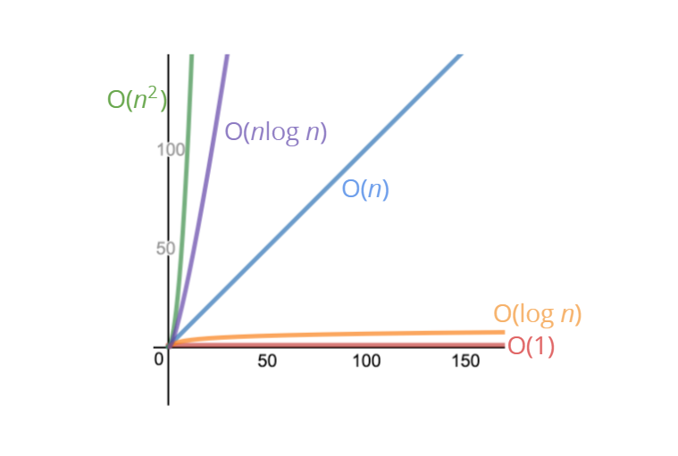

## 📈 Intro to Big O Notation

Big O notation es una forma de describir **el rendimiento y la eficiencia** de un algoritmo, especialmente en términos de cómo crece su tiempo de ejecución o uso de memoria cuando aumenta la cantidad de datos de entrada.

En otras palabras, **no mide exactamente el tiempo**, sino **cómo escala** el comportamiento del algoritmo.

La notación Big O es una forma de formalizar el conteo difuso

Nos permite hablar formalmente sobre cómo el tiempo de ejecución de un algoritmo crece a medida que crecen las entradas.

No nos preocuparemos por los detalles, sólo por las tendencias.

💡 **En pocas palabras:**

> _"¿Qué tan rápido (o lento) crecerá mi algoritmo cuando los datos crezcan?"_

---

### 🔍 ¿Por qué importa?

- Permite **comparar algoritmos** sin importar el hardware.
- Ayuda a **detectar cuellos de botella** antes de que se vuelvan un problema.
- Es clave en el **diseño de software escalable**.
- Facilita la **optimización de código** cuando el proyecto crece.
- Sirve como **lenguaje común** entre programadores para hablar de eficiencia.

---

### Tendencias

En el contexto de **Big O notation**, cuando hablamos de “tendencias” nos referimos a **cómo se comporta un algoritmo a medida que el tamaño de la entrada crece**, sin preocuparnos por detalles exactos como constantes multiplicativas o sumas menores.

Por ejemplo:

* Si tenemos una función que suma todos los números hasta `n`:

```js
function addUpTo(n) {
  let total = 0;
  for (let i = 1; i <= n; i++) {
    total += i;
  }
  return total;
}
```

Aquí, el número de operaciones crece **aproximadamente proporcional a `n`**. La “tendencia” es lineal, así que decimos que es **O(n)**. No nos importa si son exactamente `n` operaciones o `n+1` o `2n`, solo importa la **forma general del crecimiento**: lineal.

* Otro ejemplo: si tienes un algoritmo con dos bucles anidados sobre `n`:

```js
for (let i = 0; i < n; i++) {
  for (let j = 0; j < n; j++) {
    console.log(i, j);
  }
}
```

El número de operaciones crece **aproximadamente como `n²`**, entonces su tendencia es **O(n²)**.

✅ **Resumen:**
“**Tendencia**” = cómo crece la cantidad de trabajo del algoritmo cuando `n` se hace grande. No importan los números exactos, solo el patrón de crecimiento (lineal, cuadrático, logarítmico, etc.).

---

### 📊 Tipos comunes de complejidad

| Notación       | Nombre             | Ejemplo práctico                             |
| -------------- | ------------------ | -------------------------------------------- |
| **O(1)**       | Constante          | Acceder a un elemento en un array por índice |
| **O(log n)**   | Logarítmica        | Búsqueda binaria                             |
| **O(n)**       | Lineal             | Recorrer una lista completa                  |
| **O(n log n)** | Lineal-logarítmica | Ordenamiento rápido (Quicksort, Mergesort)   |
| **O(n²)**      | Cuadrática         | Comparar cada elemento con todos los demás   |
| **O(2ⁿ)**      | Exponencial        | Resolver problemas de combinatoria compleja  |
| **O(n!)**      | Factorial          | Generar todas las permutaciones posibles     |


[Performance Tracker](https://rithmschool.github.io/function-timer-demo/)

---

### 🧩 Ejemplo

**Problema:**

> Escribe una función que acepte una cadena de entrada y devuelva una copia invertida.

**Solución 1 — Iterando manualmente (O(n)):**

```javascript
function reverseString1(str) {
  let reversed = "";
  for (let char of str) {
    reversed = char + reversed;
  }
  return reversed;
}
```

**Solución 2 — Usando métodos nativos (O(n)):**

```javascript
function reverseString2(str) {
  return str.split("").reverse().join("");
}
```

**Solución 3 — Recursiva (O(n²) en algunos lenguajes):**

```javascript
function reverseString3(str) {
  if (str === "") return "";
  return reverseString3(str.substr(1)) + str[0];
}
```

🔹 Aunque las tres funcionan, la recursiva puede ser mucho más lenta y consumir más memoria en cadenas largas.

---

### 🛠 Cómo elegir la mejor opción

1. **Identifica el tamaño de los datos.**
2. **Considera la escalabilidad.** Lo que es rápido con 10 elementos puede ser lento con 10 millones.
3. **Piensa en memoria y no solo en tiempo.**
4. **Mide, no adivines.** Usa herramientas de profiling.

---

## 📌 Ejemplo: Calcular la suma de 1 hasta _n_

Supongamos que queremos escribir una función que calcule la suma de todos los números desde **1** hasta (e incluyendo) algún número **n**.

---

### **Método 1 — Usando un bucle (O(n))**

```javascript
function addUpTo(n) {
  let total = 0;
  for (let i = 1; i <= n; i++) {
    total += i;
  }
  return total;
}
```

🔹 Este método **recorre todos los números** desde `1` hasta `n`, sumándolos uno a uno.

- **Iteraciones:** `n` veces.
- **Complejidad temporal:** **O(n)**.
- **Complejidad espacial:** **O(1)** (solo usa variables `total` y `i`).

---

### **Método 2 — Usando una fórmula matemática (O(1))**

```javascript
function addUpTo(n) {
  return (n * (n + 1)) / 2;
}
```

🔹 Este método **usa la fórmula de la suma de una serie aritmética**, que siempre ejecuta **la misma cantidad de operaciones**, sin importar el tamaño de `n`.

- **Iteraciones:** 1 sola vez.
- **Complejidad temporal:** **O(1)**.
- **Complejidad espacial:** **O(1)**.

---

### ⚖ Comparativa

| Método  | Código más corto | Complejidad Temporal | Complejidad Espacial | Escalabilidad                  |
| ------- | ---------------- | -------------------- | -------------------- | ------------------------------ |
| Bucle   | No               | **O(n)**             | O(1)                 | Lento con valores grandes de n |
| Fórmula | Sí               | **O(1)**             | O(1)                 | Escala mucho mejor             |

---

💡 **Conclusión:**

- **O(n)** significa que el tiempo de ejecución crece proporcionalmente al valor de `n`.
- **O(1)** significa que el tiempo es constante, sin importar el tamaño de `n`.


